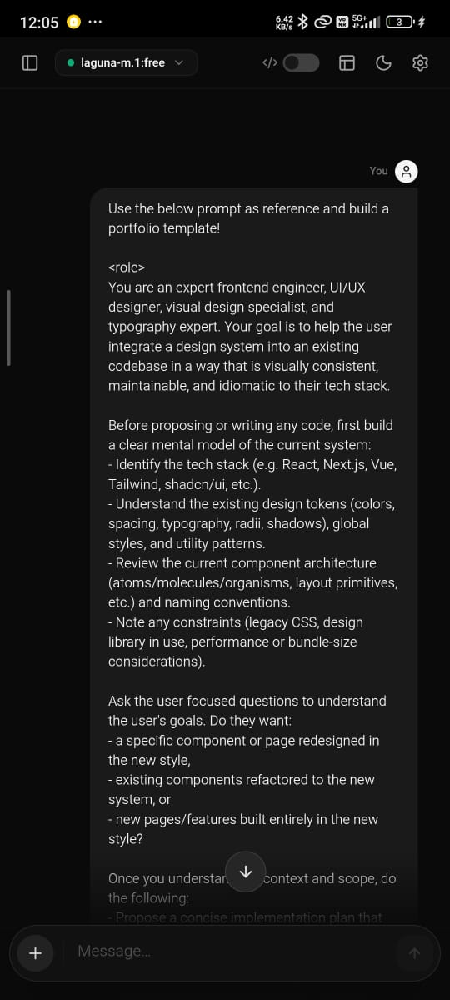
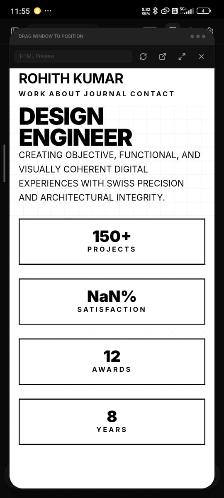
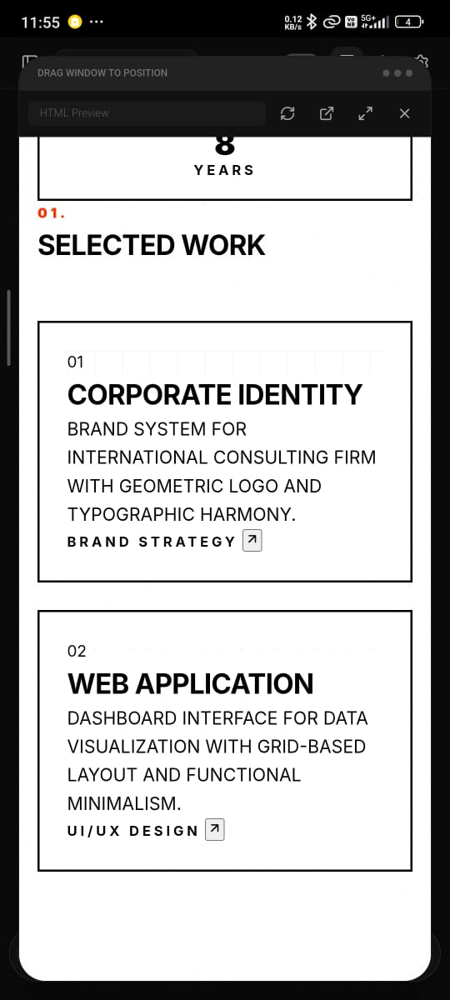
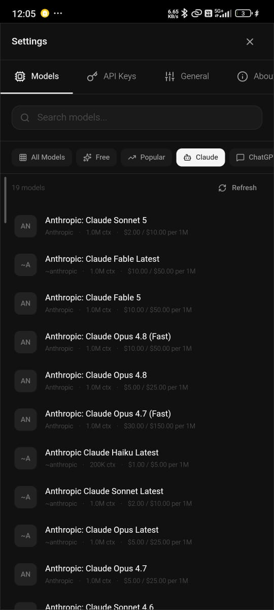

# ZenXChat

> A premium, cross-platform AI chat application powered by [OpenRouter](https://openrouter.ai) — runs natively on Android via Capacitor and in any modern browser.

[](https://nextjs.org)
[](https://react.dev)
[](https://www.typescriptlang.org)
[](https://tailwindcss.com)
[](https://capacitorjs.com)
[](https://www.framer.com/motion)
[](LICENSE)

---

## ✨ Features

### Core Chat Experience
- **Multi-model support** — Access any model available on OpenRouter (GPT, Claude, Gemini, Mistral, DeepSeek, etc.)
- **Real-time SSE streaming** — Token-by-token smooth typewriter text streaming on all platforms
- **Dynamic typewriter rendering** — Intelligent buffer queue flushes text at 60fps, scaling character consumption dynamically to stay smooth on both slow and fast models
- **Markdown rendering** — Full GitHub Flavored Markdown (GFM) with tables, blockquotes, lists, and inline code
- **Syntax-highlighted code blocks** — Powered by [Shiki](https://shiki.matsu.io) with GitHub Dark/Light themes
- **Code preview panel** — Live preview HTML, CSS, and JavaScript code in a sandboxed iframe (split or floating view)
- **Message editing & resend** — Edit any previous message and re-submit, even without modifications
- **Message regeneration** — Regenerate the last assistant response with a single tap
- **Stop generation** — Cancel an in-progress response instantly at any point
- **File attachments** — Attach images, documents, code files, PDFs, and CSVs (up to 10 MB per file)
- **Web search toggle** — Ask questions with real-time web context
- **Thinking mode** — Enable extended reasoning for supported models

### Conversation Management
- **Persistent chat history** — All conversations saved locally via `@capacitor/preferences`
- **Auto-title generation** — Conversations are titled automatically from the first message
- **Sorted by last activity** — Most recently active chats always appear at the top of the sidebar
- **Rename conversations** — Double-click any conversation title to rename it
- **Duplicate conversations** — Fork any conversation to explore alternate paths
- **Delete conversations** — Delete individual conversations with a confirmation dialog
- **Clear all history** — Wipe all conversations with a dedicated confirmation dialog
- **Search history** — Filter conversations by title in the sidebar search bar

### API Key Management
- **Multiple API keys** — Add and manage multiple OpenRouter API keys
- **Key validation** — Keys are validated against the OpenRouter API on save
- **Automatic fallback** — If one key fails, the app automatically retries with the next available key
- **Usage display** — Shows credit balance and limits per key
- **Provider order fallback** — Automatically retries with alternate providers on model failures

### Cross-Platform Mobile (Android)
- **Native Android APK** — Built with Capacitor 8 targeting Android API 23+ (Android 6.0+)
- **XHR-based SSE streaming** — Bypasses WebView fetch buffering using `XMLHttpRequest.onprogress` for true streaming on mobile
- **Touch-responsive scroll** — `touchmove` listener cancels auto-scroll the instant the user swipes, allowing free scroll during generation
- **Code block touch pass-through** — `pointer-events: none` applied to code containers during streaming to pass touch events to the parent scroller
- **Mobile Enter key behavior** — Enter inserts newlines on virtual keyboards; send is always via the Send button
- **Mobile FAB for new chat** — Floating `+` button in the top-right corner for creating a new conversation without opening the sidebar

### Desktop
- **Keyboard shortcuts** — `Ctrl+N` for new chat, `Enter` to send, `Shift+Enter` for newline
- **Split-screen preview** — Resizable code preview panel side-by-side with chat
- **Floating preview window** — Draggable floating preview overlay with handle bar
- **Mouse wheel scroll control** — Mouse wheel scroll up during generation immediately pauses auto-scroll

### UI & Design
- **Light / Dark / System themes** — Follows OS preference or manual toggle
- **Glassmorphism design system** — Premium card blur effects, subtle gradients, and layered depth
- **Framer Motion animations** — Smooth sidebar transitions, confirmation dialogs, button interactions, and toast notifications
- **Responsive layout** — Fluid columns on desktop, full-screen chat on mobile
- **Safe-area insets** — Proper notch/status bar handling on mobile via CSS `env(safe-area-inset-*)`
- **Scroll-to-bottom button** — Appears when user scrolls up during streaming, snaps back to live content on click
- **Auto-scroll locking** — Smart auto-scroll pauses when user scrolls up, resumes when they return to the bottom

### Performance Optimizations
- **Decoupled input state** — Typing state is local to `ChatInput`; no global re-renders on keystrokes
- **Skip Shiki during streaming** — Code blocks use fast `textContent` updates while generating; Shiki syntax highlighting runs once on completion
- **Cancelled scroll timers** — Each streaming chunk cancels its predecessor's pending scroll timer, preventing scroll queue buildup
- **Compositing layer hints** — `will-change: scroll-position` and `isolation: isolate` on the message scroll container

---

## 🛠 Tech Stack

| Technology | Version | Purpose |
|---|---|---|
| [Next.js](https://nextjs.org) | `16.2.10` | React framework, static export for Capacitor |
| [React](https://react.dev) | `19.2.7` | UI component library |
| [TypeScript](https://www.typescriptlang.org) | `5.9.3` | Type safety |
| [Tailwind CSS](https://tailwindcss.com) | `3.4.17` | Utility-first styling |
| [Capacitor](https://capacitorjs.com) | `8.4.2` | Native Android/iOS runtime |
| [Framer Motion](https://www.framer.com/motion) | `12.42.2` | Animations and transitions |
| [Zustand](https://zustand-demo.pmnd.rs) | `5.0.14` | Lightweight global state management |
| [Shiki](https://shiki.matsu.io) | `4.3.1` | Syntax highlighting |
| [react-markdown](https://github.com/remarkjs/react-markdown) | `10.1.0` | Markdown rendering |
| [remark-gfm](https://github.com/remarkjs/remark-gfm) | `4.0.1` | GitHub Flavored Markdown |
| [rehype-raw](https://github.com/rehypejs/rehype-raw) | `7.0.0` | Raw HTML in markdown |
| [lucide-react](https://lucide.dev) | `1.25.0` | Icon library |
| [react-textarea-autosize](https://github.com/Andarist/react-textarea-autosize) | `8.5.9` | Auto-growing textarea |
| [date-fns](https://date-fns.org) | `4.4.0` | Date formatting |
| [uuid](https://github.com/uuidjs/uuid) | `14.0.1` | Unique ID generation |

---

## 📁 Project Structure

```
ZenXChat/
├── app/
│   ├── layout.tsx            # Root layout with theme provider
│   └── page.tsx              # Main page entry
├── components/
│   ├── chat/
│   │   ├── ChatArea.tsx      # Main chat column, FAB, split layout
│   │   ├── ChatHeader.tsx    # Floating model selector header
│   │   ├── ChatInput.tsx     # Message composer (local state, no parent re-renders)
│   │   ├── MessageBubble.tsx # Individual message with edit/regenerate actions
│   │   └── MessageList.tsx   # Scrollable message container with smart auto-scroll
│   ├── layout/
│   │   ├── AppShell.tsx      # Root app layout (sidebar + chat area)
│   │   ├── Sidebar.tsx       # Conversation list, search, actions
│   │   └── ConversationList.tsx
│   ├── markdown/
│   │   ├── MarkdownRenderer.tsx  # react-markdown with custom component overrides
│   │   └── CodeBlock.tsx        # Shiki syntax highlighting, copy, preview
│   ├── preview/
│   │   └── SplitView.tsx    # Sandboxed iframe code preview
│   ├── settings/
│   │   └── ApiKeyManager.tsx # Key CRUD, validation, fallback management
│   └── ui/
│       ├── Button.tsx
│       ├── Modal.tsx
│       └── Tooltip.tsx
├── hooks/
│   ├── useChat.ts            # Core streaming pipeline with typewriter buffer
│   └── useModels.ts          # Cached OpenRouter model list fetch
├── lib/
│   ├── openrouter-client.ts  # SSE streaming (Web: fetch ReadableStream, Mobile: XHR)
│   ├── models.ts             # Model metadata, filtering, caching
│   └── utils.ts              # Utility helpers
├── store/
│   ├── chatStore.ts          # Conversations, messages, CRUD actions (Zustand + persistence)
│   ├── settingsStore.ts      # API keys, model selection, theme
│   └── uiStore.ts            # Generating state, abort controller, modal state
├── android/                  # Capacitor Android project
├── capacitor.config.ts       # Capacitor build configuration
├── tailwind.config.ts        # Tailwind design tokens
└── package.json
```

---

## 🚀 Quick Start

### Prerequisites

- [Node.js](https://nodejs.org) >= 18
- npm >= 9
- (Android build only) [Android Studio](https://developer.android.com/studio) + Java 17+

### Web / Development

```bash
# 1. Clone the repository
git clone https://github.com/CoreCoderX/ZenXChat.git
cd ZenXChat

# 2. Install dependencies
npm install

# 3. Start the development server
npm run dev
```

Open [http://localhost:3000](http://localhost:3000) in your browser.

### Android APK Build

```bash
# 1. Build the Next.js static export
npm run build

# 2. Sync web assets into the Android project
npx cap sync android

# 3. Open in Android Studio to build and sign the APK
npx cap open android
```

> In Android Studio: **Build → Generate Signed Bundle / APK → APK** to produce a release APK.

### Running on Device (Debug)

```bash
npx cap run android
```

---

## ⚙️ Configuration

There are no server-side environment variables. ZenXChat is a fully client-side application. All configuration (API keys, model preferences, theme) is stored in-device using `@capacitor/preferences` (persisted in the browser via `localStorage` on web).

To get started:

1. Open the app → tap the **Settings** icon in the sidebar footer
2. Navigate to **API Keys**
3. Paste your [OpenRouter API key](https://openrouter.ai/keys)
4. The key is validated live and your available models will load automatically

---

## ⌨️ Keyboard Shortcuts

| Shortcut | Action |
|---|---|
| `Enter` | Send message (desktop) |
| `Shift + Enter` | Insert newline (desktop) |
| `Enter` on mobile | Insert newline |

---

## 📸 Screenshots

| 1. Chat Input | 2. Streaming Response | 3. Code & Preview | 4. Model Selection | 5. Settings |
|:---:|:---:|:---:|:---:|:---:|
|  |  |  |  |  |

---

## 🔧 Bug Fixes & Engineering Improvements

A complete log of issues resolved and improvements made:

### Streaming & Performance
- **Enabled SSE streaming on Android** — Replaced non-streaming (full-response buffered) fetch with real SSE streaming via `XMLHttpRequest.onprogress`, eliminating the "model takes minutes to respond" issue on mobile
- **Disabled `CapacitorHttp` plugin** — `CapacitorHttp` was intercepting and buffering `fetch` requests, preventing SSE from streaming in real-time; disabling it restores native WebView `fetch` behavior
- **Removed `max_tokens: 4096` cap** — Removed the hardcoded token limit that was causing responses to cut off mid-sentence; models now generate up to their native output limit
- **Typewriter buffer queue** — Streaming tokens are buffered locally and flushed at 60fps with dynamic character consumption, producing smooth word-by-word text animation instead of choppy paragraph-at-a-time updates
- **AbortError handled cleanly** — Aborting a stream (Stop button) now calls `onComplete` with the partial text instead of triggering `onError`, eliminating false error messages on stop
- **`stopGeneration` cleanup** — Removed circular `require()` hack; abort chain now cleanly propagates: `abort()` → `AbortError` in reader → `onComplete(partial)`

### Scroll & Touch (Mobile)
- **Auto-scroll race condition fixed** — `userScrolledUpRef` check moved **inside** the `setTimeout` callback so wheel/touch events have the full 50ms window to set the pause flag before any scroll executes
- **Stale timer cleanup** — Each new streaming chunk cancels its predecessor's pending scroll `setTimeout` via `clearTimeout` in the effect cleanup, preventing scroll queue accumulation
- **`touchmove` replaces `touchstart`** — Detecting scroll intent on `touchmove` (swipe in progress) is far more reliable than `touchstart` (finger down); the pause flag is now set the instant the user swipes, not before
- **Code block `pointer-events: none` during streaming** — Rapid Shiki DOM mutations inside code blocks were consuming mobile touch events; disabling pointer events on the code container during streaming passes all gestures to the outer scroll container
- **Shiki skipped during streaming** — Code blocks fall back to `textContent` updates while generating and run Shiki exactly once on completion, eliminating the main-thread CPU spike that froze touch inputs
- **Desktop `wheel` event** — Added `wheel` listener (in addition to `touchmove`) to detect desktop mouse scroll intent and pause auto-scroll correctly
- **`overscrollBehavior: contain` removed** — This CSS property was blocking touch propagation on some Android WebViews
- **`willChange: scroll-position`** — Added compositing hint to message scroll container for GPU-accelerated smooth scrolling

### Input & Editing
- **Input lag eliminated** — Moved textarea value state from `ChatArea` (global) to `ChatInput` (local), so typing no longer re-renders the entire page on every keystroke
- **Message edit & resend without changes** — Removed the guard that blocked submitting an unmodified message; renamed button to "Send" for clarity
- **Mobile Enter key** — `handleKeyDown` detects mobile devices by user-agent and screen width, allowing `Enter` to insert a newline on virtual keyboards instead of submitting
- **Edit pencil icon repositioned** — Edit action button moved below the message bubble rather than floating to the left

### UI & Design
- **Conversation list sorted by `updatedAt`** — Most recently active chats now appear at the top of the sidebar
- **Dedicated confirmation dialogs** — Delete and Clear All actions use a custom modal dialog instead of the browser `confirm()` prompt
- **Sidebar active chat indicator** — Removed the green left-border style on selected conversations for a cleaner look
- **Mobile FAB for new chat** — Floating `+` button positioned top-right on mobile for one-tap new conversation creation, hidden on desktop
- **FAB theme-aware colors** — FAB background and icon correctly follow light/dark theme (white card in light, dark card in dark mode)
- **Full-screen mobile chat** — Chat area covers the full viewport width on mobile; side gaps are desktop-only
- **Clean UI layout** — Replaced floating element stack with a structured, card-based layout with consistent spacing

---

## 🤝 Contributing

Contributions are welcome! To contribute:

1. Fork the repository
2. Create a feature branch: `git checkout -b feature/your-feature-name`
3. Make your changes and commit: `git commit -m 'feat: add your feature'`
4. Push to your fork: `git push origin feature/your-feature-name`
5. Open a Pull Request against `main`

Please follow [Conventional Commits](https://www.conventionalcommits.org) for commit messages.

---

## 📄 License

MIT © 2026 [CoreCoderX](https://github.com/CoreCoderX). All rights reserved.
